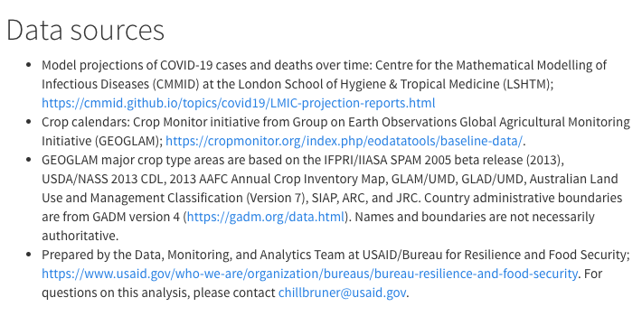

## {{names(combined.plots[i])}} 

```{r country-plots-{{names(combined.plots[i])}}, fig.align='center', fig.height=6, echo = FALSE, warning = FALSE}
  country = "{{names(combined.plots[i])}}"
  # try separate.. need to align them
  cases = combined.plots[[country]][['cases']]
  crop_plot = combined.plots[[country]][['crop_plot']][[1]]
  # adjust legend
  cases = cases + theme(legend.position = "top", legend.title.align=0.5,
                        legend.spacing = unit(0.05, 'cm'), legend.key.width = unit(0.4, "cm")
                        # this is really finicky.. and is affected by subsequent resizing
                        # legend.position = c(-0.2, 1.7), # x and y between 0 and 1
                        # legend.justification = c("left", "top"),
                        # plot.margin=unit(c(2,0,0,0),"cm")
    ) + guides(color=guide_legend(title.position = "top",  nrow=4)) # ,label.position = "bottom" 
  # remove title from crop_plot
  crop_plot = crop_plot + theme(plot.title = element_blank())
  # increase axis label sizes
  crop_plot = crop_plot + theme(axis.text.x = element_text(angle=90, size=10))
  cases = cases + theme(axis.text.x = element_text(angle=90, size=10))
  # increase legend font size
  cases = cases + theme(legend.text = element_text(size=7))
  # with plot grid
  together <- plot_grid(cases, crop_plot, ncol=1, align="v", rel_heights = c(3, 1.5))
  together
```

<!-- { width=3in } -->

```{r country-text-maps-include-graphics-method-{{names(combined.plots[i])}}, echo=FALSE, out.width = "49%", out.height = "20%", fig.show = "hold", fig.align = "center"}
country = "{{names(combined.plots[i])}}"
sourcetext = readPNG("source_text.png")
sourcetext = rasterGrob(sourcetext)
#include_graphics(c("source_text.png","path/to/img1"))
```

```{r country-text-maps-grid-method-{{names(combined.plots[i])}}, echo=FALSE, out.width="95%", fig.align='center'}
country = "{{names(combined.plots[i])}}"
sourcetext = readPNG("source_text.png")
sourcetext = rasterGrob(sourcetext)
#grid.arrange(sourcetext, combined.plots[[country]][['map_plot']][[1]])
#plot_grid(sourcetext, combined.plots[[country]][['map_plot']][[1]], ncol=2, rel_widths = c(1.5, 1))
```

\  

:::::: {.columns}

::: {.column width="48%" data-latex="{0.48\textwidth}"}
**Data sources**

\  

\scriptsize

* Model projections of COVID-19 cases and deaths over time: Centre for the Mathematical Modelling of Infectious Diseases (CMMID) at the London School of Hygiene & Tropical Medicine (LSHTM); https://cmmid.github.io/topics/covid19/LMIC-projection-reports.html
* Crop calendars: Crop Monitor initiative from Group on Earth Observations Global Agricultural Monitoring Initiative (GEOGLAM); https://cropmonitor.org/index.php/eodatatools/baseline-data/. 
* GEOGLAM major crop type areas are based on the IFPRI/IIASA SPAM 2005 beta release (2013), USDA/NASS 2013 CDL, 2013 AAFC Annual Crop Inventory Map, GLAM/UMD, GLAD/UMD, Australian Land Use and Management Classification (Version 7), SIAP, ARC, and JRC. Country administrative boundaries are from GADM version 4 (https://gadm.org/data.html). Names and boundaries are not necessarily authoritative.
* Prepared by the Data, Monitoring, and Analytics Team at USAID/Bureau for Resilience and Food Security; https://www.usaid.gov/who-we-are/organization/bureaus/bureau-resilience-and-food-security. For questions, contact chillbruner@usaid.gov.

\normalsize
```{r country-text-col-method-{{names(combined.plots[i])}}, echo=FALSE, fig.align='center'}
sourcetext = readPNG("source_text.png")
sourcetext = rasterGrob(sourcetext)
#grid.arrange(sourcetext) # or grid.draw?
```

<!-- https://bookdown.org/yihui/rmarkdown-cookbook/multi-column.html -->
:::
::: {.column width="2%" data-latex="{0.02\textwidth}"}
\ 
<!-- an empty Div (with a white space), serving as
a column separator -->
:::

::: {.column width="48%" data-latex="{0.48\textwidth}"}
```{r country-maps-col-method-{{names(combined.plots[i])}}, echo=FALSE, fig.align='center', results='asis'}
country = "{{names(combined.plots[i])}}"
grid.arrange(combined.plots[[country]][['map_plot']][[1]])
```
:::
::::::

```{r country-maps-{{names(combined.plots[i])}}, fig.align = 'center', echo = FALSE, results='asis', out.width='40%'}
  # fig.width=3.7,
  # these are the country maps
  #country = "{{names(combined.plots[i])}}"
  # the actual maps
  #grid.arrange(combined.plots[[country]][['map_plot']][[1]])
  #cat("  \n")
```
